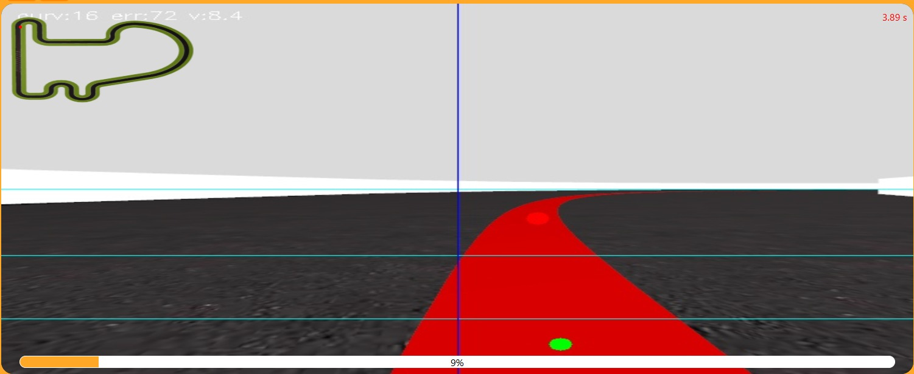
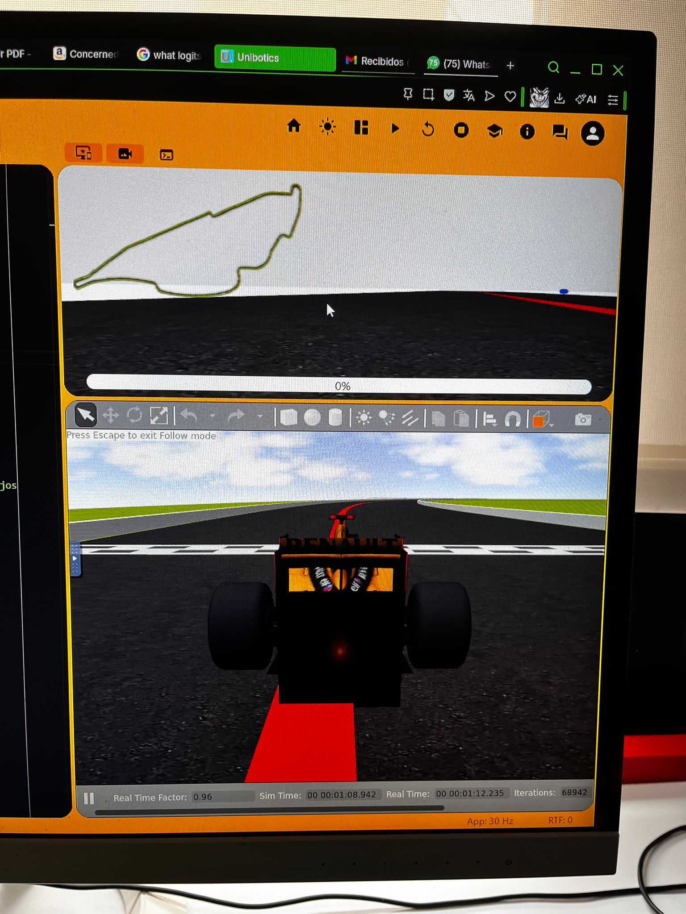
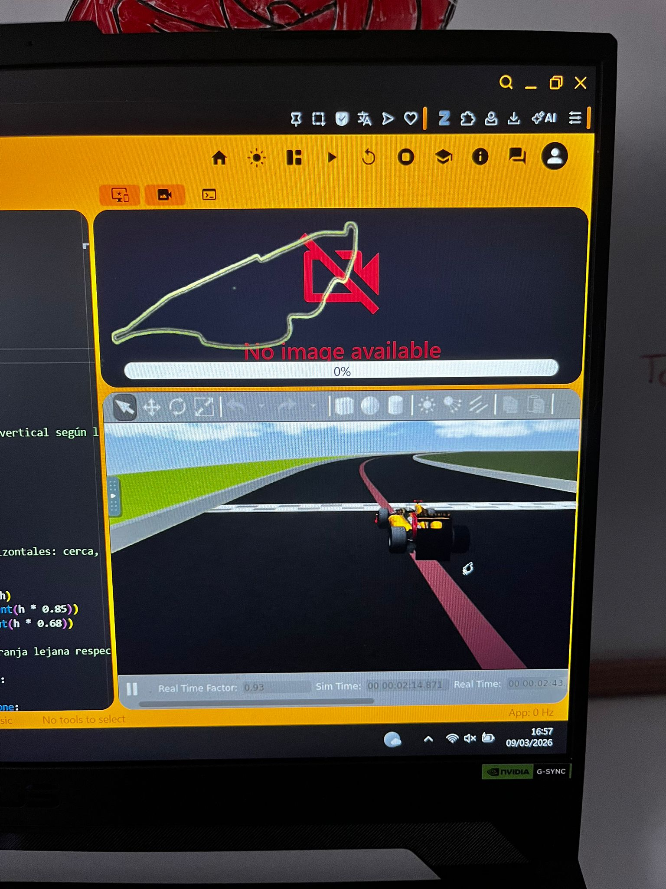

# Práctica 1: Control Reactivo (Follow Line)

En esta primera práctica de robótica, se busca implementar una solución para el problema de Unibotics: Follow Line. La práctica consiste en conseguir que el robot (en este caso un coche de fórmula 1), siga la línea roja pintada sobre la carretera de varios circuitos, recibiendo la imagen únicamente a través de una cámara frontal. 

El reto no es solo seguir la línea, sino hacerlo de manera estable y rápida ante condiciones variables (rectas, curvas de distinta apertuda y transiciones entre ambas). Para ello adoptamos el enfoque del control reactivo cerrado, donde la señal de control (el ángulo de giro del vehículo) se calcula en cada frame a partir del error visual entre la posición de la línea y el centro de la imagen.

A continuación, comentaré en secciones cómo se ha llevado a cabo el desarrollo de la práctica, la implementación final y los problemas encontrados, empezando por el preprocesado de la imagen.


## 1. Preprocesamiento


Lo primero que necesitamos para que el robot vea la línea roja a seguir es definir un espacio de color para aislarla del resto de cosas que vemos en la imagen. Para ello, usé un rango HSV para definir los valores del color rojo. Utilicé el espacio HSV ya que es más robusto frente a cambios de iluminación y realicé la suma de dos rangos de color rojo ya que HSV no tiene un rango continuo, aparece tanto en la zona baja (H: 0-10) como en la alta (H: 160-180). De esta manera, me aseguro de que la tonalidad de rojo está siendo capturada.


| Rango                | Resultado                                              |
|:---------------------|:-------------------------------------------------------|
| Bajo 0-10            | Detección en zonas parcialmente oscuras                | 
| Alto 160-180         | Detección en zonas parcialmente iluminadas             | 
| Combinación de ambos | Detección completa y robusta durante todo el recorrido | 


El resultado es una imagen binaria donde los pixeles blancos corresponden a la línea roja. Sobre esta máscara se calcula el centroide mediante momentos de imagen de OpenCV, obteniendo la coordenada X del punto medio de la línea en cada zona analizada.

En esta sección no hubo muchos problemas, el cálculo de la máscara se hizo realizando una búsqueda del color rojo sobre el espacio HSV y funcionó a la primera. El debug de los centroides también funcionó correctamente.


## 2. Control PD


El siguiente paso fue asignarle una velocidad estándar al robot para que empezara a moverse. Al asignarle una velocidad continua y llegar a una curva se chocaba, aquí es donde entra en juego el control del giro del robot, haciendo uso de un control PD. La fórmula de control del regulador PD es:

> **W = −( Kp · e + Kd · Δe/Δt )**

donde:
- **e** = cx − c\_imagen → error lateral en píxeles
- **Δe** = e(t) − e(t−1) → variación del error entre frames  
- **Kp = 0.003** → ganancia proporcional  
- **Kd = 0.08** → ganancia derivativa


Como se menciona, el error viene dado por la diferencia entre cx (que representa el centroide de la línea roja), el cual calculamos con momentos de OpenCV, y el centro de la imagen (que es el punto de referencia con el que queremos alinear la línea roja). En cuanto al término proporcional, este produce una corrección proporcional al desplazamiento actual de la línea mientras que el término derivativo actúa sobre la velocidad de cambio del error: si el error crece rápidamente (el coche se está desviando cada vez más), aplica una corrección adicional; si el error decrece (el coche se está centrando), frena la corrección para evitar sobrepasar el centro.

En un primer intento, implementando únicamente la parte proporcional, el robot era ya capaz de seguir la línea (a una velocidad moderada) durante todo el recorrido y sin demasiada oscilación. El tiempo final en dar una vuelta con esta configuración fue de 190 segundos, muy lejos de la marca fijada a 90 segundos.

El siguiente paso fue subir la velocidad, esto resultó en el vehículo derrapando practicamente en la primera curva. La solución fue añadir la constante derivativa para corregir la trayectoria en aquellos tramos de mayor error (es decir, en las curvas). Con esto se logró una reducción de casi la mitad de tiempo, llegando ahora a los 100 segundos por vuelta. 

En esta sección el problema principal residía en ajustar Kp y Kd, teniendo que experimentar con distintas configuraciones hasta hallar la que mejor y más consistentes resultados obtenía (siendo estos valores los mencionados en la fórmula del control PD). 

- **Kp bajo, Kd bajo:** El coche reacciona tarde a las curvas. Pierde la línea en curvas cerradas por falta de corrección.
- **Kp alto, Kd bajo:** El coche oscila alrededor de la línea incluso en rectas. Las correcciones se amplifican en cada frame formando un movimiento de zigzag.
- **Kp bajo, Kd más elevado que Kp**: El coche sigue la línea prácticamente sin oscilaciones y recupera el centro suavemente tras las curvas. Este fue el comportamiento objetivo.


Este podría haber sido el punto final pero quise reducir el tiempo por lo que el siguiente paso sería cambiar la velocidad constante por una adaptativa.


## 3. Ajustando la velocidad (detección multizona y lookahead)


Al tener una velocidad constante, al cambiar de tramo bruscamente, corría el riesgo de que el coche chocase y no pudiera decelerar o frenar para aprovechar el tramo del circuito. Para solucionarlo, decidí implementar una velocidad que se adaptase según se acercase una curva o recta.

Con un único centroide global, el robot no tenía suficiente información para anticiparse a lo que viene más adelante, solo reaccionaba cuando la curva ya estaba debajo del coche provocando deceleraciones tardía y correcciones bruscas. Para poder anticiparme, dividí la imagen en tres franjas horizontales para analizar la línea a distintas distancias:

<div style="text-align:center">
  
</div>

<table style="width:100%; border-collapse:collapse; font-family:monospace; font-size:0.9em;">
  <tr style="background:
#1a1a1a;">
    <td style="border:1px solid #444; padding:8px; color:#888; width:15%;">0%</td>
    <td style="border:1px solid #444; padding:8px; color:#888;">(cielo / fondo) — sin información útil</td>
  </tr>
  <tr style="background:
#0d2200;">
    <td style="border:1px solid #444; padding:8px; color:
#ff4444; width:15%;">50 – 68%</td>
    <td style="border:1px solid #444; padding:8px; color:
#ff4444;">● <strong>cx_far</strong> — lookahead: lo que viene</td>
  </tr>
  <tr style="background:
#0d1a00;">
    <td style="border:1px solid #444; padding:8px; color:
#ffff00; width:15%;">68 – 85%</td>
    <td style="border:1px solid #444; padding:8px; color:
#ffff00;">● <strong>cx_mid</strong> — zona intermedia</td>
  </tr>
  <tr style="background:
#001a00;">
    <td style="border:1px solid #444; padding:8px; color:
#00ff00; width:15%;">85 – 100%</td>
    <td style="border:1px solid #444; padding:8px; color:
#00ff00;">● <strong>cx_near</strong> — zona cercana: control inmediato</td>
  </tr>
</table>

Al calcular la diferencia horizontal entre el centroide de la zona lejana y la cercana obtengo la curvatura anticipada. Cuando ambos centroides coinciden, el tramo es recto y puede acelerar y cuando divergen, significa que hay una curva más adelante y por tanto empieza a frenar.

Por lo tanto, la velocidad adaptativa va a depender de los siguientes factores:
- **Error actual:** refleja cuánto se ha desviado ya el coche
- **Curvatura anticipada:** lo que viene según la franja lejana


Ambos se combinan tomando el máximo de los dos, con un peso adicional sobre la curvatura para que el sistema frene antes de llegar a la curva, no cuando ya está en ella.

```py
shape_factor = max(error_norm, curvature_norm × 1.3)
v = max_velocity − (max_velocity − min_velocity) × shape_factor
```


Esta es sin duda la parte más problemática y en donde más pruebas he hecho en la práctica. Todo ha sido experimental a base de prueba y error: ajustar los rangos de velocidades para el circuito simple, ajustar la Kp y Kd acordes, y especial importancia a las franjas de rangos, que son los que me permiten anticiparme (aunque solo sea un poco ya que no hay suficiente tiempo de anticipación), para poder capturar la variación de la línea a lo largo del circuito y adaptarme a ella. 

Cabe destacar que todos estos valores (Kp, Kd y los valores de velocidad) posiblemente deban ser ajustados según el circuito (los rangos de las franjas parecen no variar) como podemos ver en los resultados a continuación.


## 4. Vuelta final y probando circuitos


### Simple Circuit
<div style="text-align:center">
  <iframe width="700" height="394"
  src="https://www.youtube.com/embed/w43bQVF1FJw"
  frameborder="0" allowfullscreen>
  </iframe>
</div>


La prueba principal sobre el circuito simple. Como se puede observar, el coche sigue la línea en todo momento durante el circuito, manteniéndose cerca incluso en las curvas y prácticamente sin oscilaciones bruscas. El tiempo de vuelta queda reducido finalmente a 60 segundos, una marca seguramente mejorable pero bastante buena en comparación con los 200 segundos iniciales. El rtf se mantiene al 99% casi todo el rato, lo que indica que el tiempo es practicamente 1 a 1 con el del simulador. 


### Montmelo Circuit
<div style="text-align:center">
  <iframe width="700" height="394"
  src="https://www.youtube.com/embed/4DEuwPCm53Q"
  frameborder="0" allowfullscreen>
  </iframe>
</div>


El primer circuito que probé después del desempeño satisfactorio obtenido en Simple Circuit. En este circuito el coche sigue la línea como se espera, sin oscilaciones y adaptando bien la velocidad. Cabe destacar (como pasa en los circuitos que veremos a continuación) que el rtf baja mucho en algunos tramos del circuito, llegando a bajar hasta el 6% lo que realentiza el procesamiento del sistema y creo que es lo que afecta a que se choque en la 7ª curva. También puede deberse a lo que mencionaba en el apartado anterior sobre ajustar las constantes y sacrificar velocidad por consistencia y estabilidad.


### Monaco Circuit
<div style="text-align:center">
  <iframe width="700" height="394"
  src="https://www.youtube.com/embed/w8XTNiviupE"
  frameborder="0" allowfullscreen>
  </iframe>
</div>


En un principio no iba a probar este circuito porque creo recordar que se nos aconsejó que no lo probasemos en el aula, aún así quería ver qué tal se manejaba mi sistema en este caso. En general funciona bien, el circuito es largo con un par de curvas cerradas, el rtf se mantiene en 40-60% llegando a bajar al 10% en algunos casos. Esto de nuevo puede ser la causa de que en la primera curva cerrada, el coche pierda el control (habría que probar a ajustar los parámetros de nuevo).


### Nurburgring y Montreal Classic Circuit
<div style="text-align:center">
  <iframe width="700" height="394"
  src="https://www.youtube.com/embed/55VyaNZQHRU"
  frameborder="0" allowfullscreen>
  </iframe>
</div>


Estos dos sin duda son los que más quebraderos de cabeza me han dado. Para empezar el Montreal Circuit ni me carga, he tenido que probar directamente el Classic (aunque no debería haber diferencia entre ellos). En ambos circuitos nada más comenzar, el coche derrapa y se estampa contra la pared. He probado a ajustar la Kp, la Kd, los rangos de velocidad, ponerle una velocidad baja constante, nada parece funcionar. No solo eso, parece que no detecta la línea siquiera, lo cual es extraño porque funciona igual que en el resto de circuitos. No he conseguido dar con la solución pero me he fijado en los blogs de los compañeros y veo que han tenido problemas similares con estos circuitos por lo que no termino de comprender si es problema mio o qué puede estar fallando. Además como pequeño apunte curioso, he probado el circuito en dos ordenadores distintos y... ¡la línea es de distinto color! ¿Será cosa de mi configuración en alguna de mis máquinas?

<div style="display:flex; gap:10px; justify-content:center">
  
  
</div>


## 5. Conclusiones


En resumen, la práctica ha sido muy instructiva, entretenida y en cierta manera compleja. Lo que parecía que tenía una solución fácil al principio implementando sólo Kp y llegando a 200 segundos, ha resultado ser un reto para conseguir bajar el tiempo cerca del minuto sin sacrificar el seguimiento sin oscilaciones de la línea (y eso sólo en el circuito simple). 
Quedan por probar muchas cosas, como la implementación de la componente integral del control PID, ajustar los parámetros a cada circuito, o incluso plantear una mejor forma de anticiparse a los cambios en el trazado para adaptar la velocidad. Ha sido una práctica completa que demuestra las capacidades y posibilidades del control reactivo.

[back](./)
