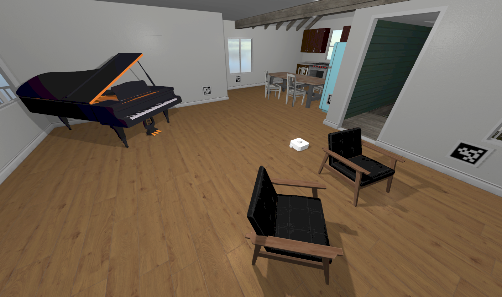

# Práctica 1: Control Reactivo

  

[¡Leer aquí!](./another-page.html).

# Práctica 2: Reconstrucción 3D

  

[¡Leer aquí!](./p2.html).

# Práctica 3: Autolocalización

  

[¡Leer aquí!](./p3.html).

# Práctica 4: Control Visual con DL

  

[¡Leer aquí!](./p4.html).
