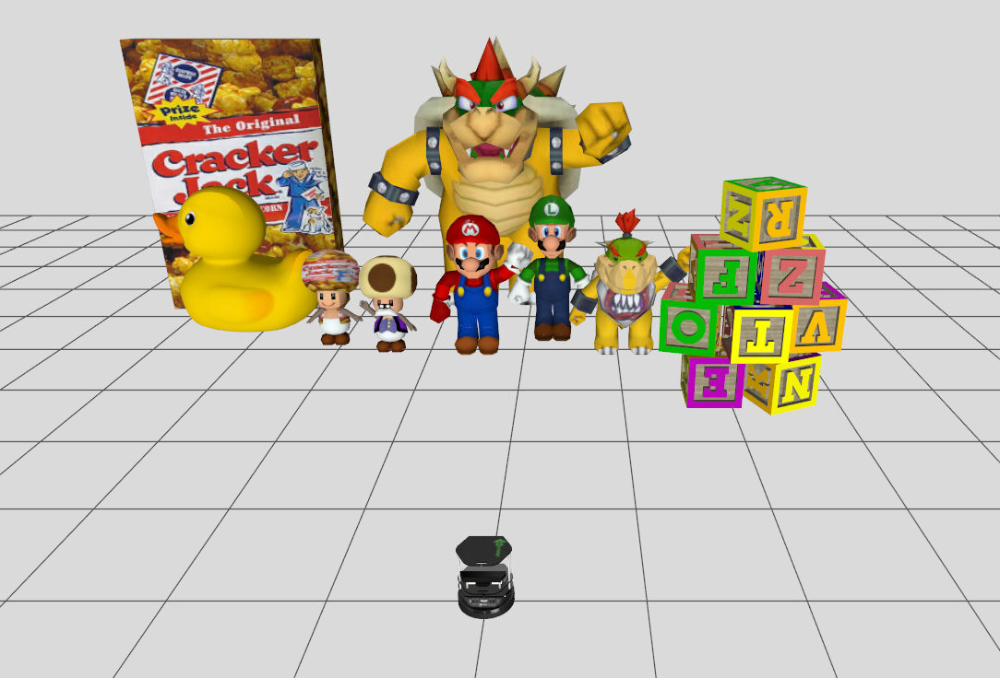
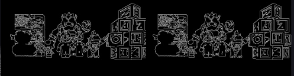
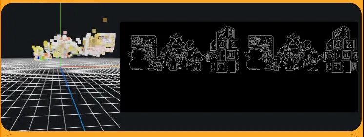
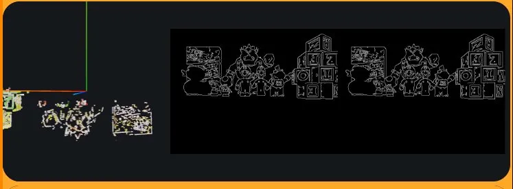

# Práctica 2: Reconstrucción 3D

En esta segunda práctica de robótica, se busca implementar una solución para el problema de Unibotics: 3D Reconstruction. La práctica consiste en reconstruir una serie de objetos que se ven en la escena (figuras de Mario Bros, caja de cereales, bloques de letras y un pato) a partir de las imágenes recibidas por un par de cámaras estéreo. 

El reto reside en obtener una nube de puntos que represente los bordes de los objetos de la escena, para ello deberemos usar los conceptos aprendidos en clase sobre retropoyección, matching de puntos y tener en cuenta la geometría epipolar.

  

A continuación, comentaré en secciones cómo se ha llevado a cabo el desarrollo de la práctica, la implementación final y los problemas encontrados, empezando por el preprocesado de la imagen.

## 1. Preprocesamiento

Antes siquiera de procesar un solo píxel, necesitamos modelar matemáticamente cómo ven el mundo las cámaras de nuestro robot. Para ello, comenzamos guardando las constantes físicas del sensor proporcionadas por la consola del simulador (donde se nos indican las matrices intrínseca (K) y extrínsecas (RT)):
* **Focal (F = 240.0):** distancia focal en píxeles, define la perspectiva de la cámara.
* **Centro Óptico (CX = 320.0, CY = 240.0):** como nuestras imágenes son de 640x480, este es el punto exacto donde el rayo central de luz impacta en el sensor de la cámara.
* **Línea Base (B = 220.0 mm):** distancia física que separa la cámara izquierda de la derecha. Cuanto mayor sea esta separación, mejor percepción de profundidad tendrá el robot para objetos lejanos. En la consola se muestra que la traslación desde el eje central a cada cámara es de 110mm por tanto de ahí obtenemos el valor de 220mm.

Con estos datos, construimos las **Matrices de Proyección Estéreo (P1 y P2)** porque la función de triangulación que usaremos más adelante las necesita para entender dónde están las cámaras en el espacio 3D. 
* **Matriz P1 (Cámara Izquierda):** la establecemos como el origen del universo (0,0,0). 
* **Matriz P2 (Cámara Derecha):** es idéntica a P1, pero le indicamos que está desplazada en el eje X según la línea base. Ese desplazamiento se codifica en la última columna multiplicando la focal por la línea base.

El siguiente paso para que el robot pueda emparejar puntos entre la cámara izquierda y la derecha, es extraer características útiles de las imágenes. Procesar todos los píxeles de la imagen (640x480) hundiría el rendimiento del sistema, así que vamos a aislar solo los bordes.

Para limpiar la imagen de ruido del sensor y variaciones de luz sin destruir la información importante, utilicé un filtro bilateral que a diferencia de un desenfoque gaussiano, suaviza las zonas planas respetando los contrastes fuertes. 

Sobre estas imágenes filtradas, apliqué el algoritmo de Canny para obtener una máscara binaria de los bordes. De esta manera, me aseguro de limitar la búsqueda de correspondencias únicamente a las siluetas que definen la estructura de la escena, reduciendo drásticamente el coste computacional sin perder la interpretación de las figuras.

  

## 2. Emparejamiento y Geometría Epipolar

El siguiente paso, y el núcleo de la práctica, es tomar un píxel de borde en la cámara izquierda y encontrar su píxel homólogo en la cámara derecha. Buscar en toda la imagen derecha sería imposible, por eso aplicamos el uso de la geometría epipolar.

En un principio, se podría asumir que las cámaras están perfectamente alineadas y buscar el píxel simplemente desplazándonos por la misma fila horizontal. Sin embargo, para hacer un sistema robusto y general (que funcione en robots reales donde las cámaras pueden no ser canónicas), implementé la proyección matemática de rayos.
El proceso es el siguiente:

1.  Tomo un punto de la cámara izquierda y trazo un rayo imaginario hacia el espacio 3D.
2.  Proyecto ese rayo sobre la cámara derecha, dibujando una línea recta sobre la imagen derecha.
3.  Busco el píxel homólogo iterando única y exclusivamente a lo largo de esa línea.

Para saber si dos píxeles son el mismo, no comparamos píxel a píxel, sino que extraigo un "parche" o ventana de 15x15 píxeles alrededor del punto izquierdo y uso *Template Matching* para buscar ese mismo patrón de textura en la línea derecha. 

En esta sección el problema principal residía en los falsos positivos (el parche se emparejaba con el fondo por error). La solución fue añadir un **límite de disparidad**. Como la cámara derecha está desplazada físicamente a la derecha, el objeto siempre aparecerá más a la izquierda en su imagen. Acotando la búsqueda a un máximo de 150 píxeles hacia la izquierda, logré capturar tanto el fondo como los bloques en primer plano, eliminando parte del ruido. 

También cabe destacar que hago uso de la acotación que utiliza mi compañero **Jorge Lozoya** en su blog, me parecía muy útil ya que al acotar la línea de proyección bajo un rango de valores mínimos y máximos de profundidad, evitamos representar puntos fantasma y eliminamos ruido en la triangulación y representación final.

## 3. Triangulación y Reconstrucción

Cuando encontramos un parche gemelo que supera nuestro umbral, tenemos un par de coordenadas 2D correspondientes al mismo objeto físico. Al tener las coordenadas 2D del mismo punto en ambas cámaras, el último paso es transformarlo en un punto 3D (X, Y, Z), utilizando la triangulación matricial (mediante la función triangulatePoints), cruzando los rayos visuales mediante las matrices de proyección de las cámaras (que contienen la focal y la distancia de la línea base), devolviendo un vector en coordenadas homogéneas 4D. Dividiendo las tres primeras coordenadas por la cuarta, obtenemos finalmente nuestra coordenada cartesiana tridimensional (X, Y, Z) en milímetros.

Esta fue sin duda la parte visualmente más problemática y donde los fallos de calibración se hicieron más evidentes:

* **Los puntos apelotonados en el origen:** en las primeras fases que intenté implementar la triangulación, los puntos se apelotonaban en el origen de la cámara del robot. Esto era porque en un principio extraía directamente las coordenadas homogéneas sin dividir el vector obtenido por la cuarta coordenada (la escala), lo cual resultaba en que los valores del vector fueran cercanos a cero y se representaran en el origen. Además, antes de implementar el límite de disparidad, mi sistema podía emparejar por error un píxel del extremo derecho de la imagen izquierda con uno del extremo izquierdo de la imagen derecha. Esto generaba una disparidad gigante y al dividir por un número tan grande, la profundidad tendía a 0, interpretando que esos falsos positivos estaban pegados al cristal de la cámara. Este problema se erradicó por completo al introducir la restricción de recorte de profundidad que comentaba en el apartado anterior (Z_MIN = 2000) descartando cualquier punto matemáticamente inferior a 2 metros de distancia, y acotando el rango máximo de búsqueda de disparidad horizontal.

  

* **Los colores "radiactivos":** en mis primeras pruebas, Mario aparecía de color cian brillante en lugar de rojo, resultó que las imágenes de la simulación se capturan en formato BGR y al extraer el color y proyectarlo sin invertir el orden a RGB, los canales rojo y azul estaban intercambiados.
  
* **La escena al revés:** al visualizar la nube de puntos en el visor web, la escena aparecía dada la vuelta y en espejo. Esto es dado que los ejes están apuntando de distinta manera a como yo pensaba, una rápida solución fue poner un menos sobre el eje Y y el X y ya tenía la escena del derecho.

  

* **La escena enterrada:** ahora al visualizar la nube de puntos en el visor web, la escena aparecía cortada por la mitad, enterrada bajo la cuadrícula del suelo. Esto ocurre porque el origen de coordenadas (0,0,0) es el centro de la cámara del robot, que está a cierta altura del suelo. La solución fue aplicar un offset vertical (una traslación en el eje Y) para levantar toda la nube de puntos y que reposara visualmente sobre la cuadrícula.

## 4. Resultado Final

  <iframe width="700" height="394"
  src="https://www.youtube.com/embed/W_Qcs3pPGiA"
  frameborder="0" allowfullscreen>
  </iframe>

## 5. Conclusiones

Esta práctica ha resultado ser muy completa e instructiva, un poco más complicada que la anterior pero menos experimental. La posibilidad de poder reconstruir cualquier escena a partir de la información obtenida por dos cámaras sin tener un sensor de profundidad me parece muy interesante, sin embargo, requiere de mayor conocimiento matemático y técnica, de ahí la complejidad y los problemas que me han surgido. 

Seguramente queden por probar muchas optimizaciones, pero aún así, considero que se ha obtenido una nube de puntos lo suficientemente densa y precisa para el objetivo de la práctica.

[back](./)
